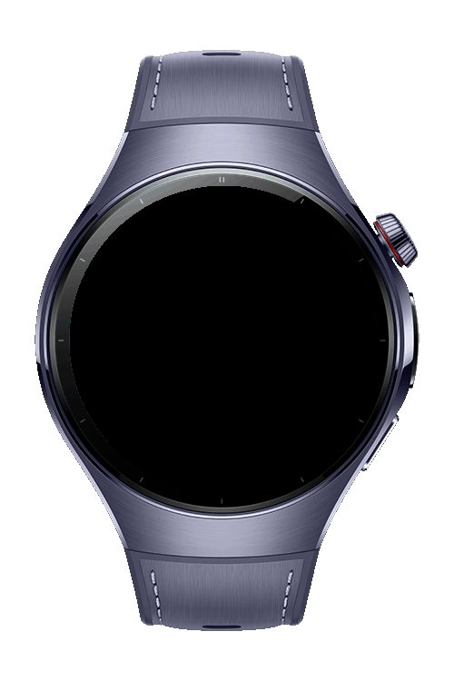
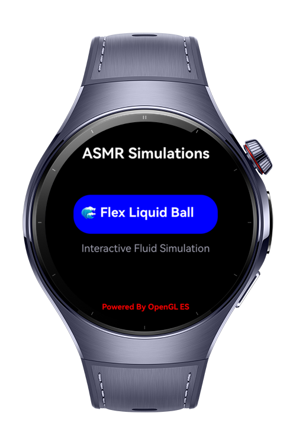

> **Note:** To access all shared projects, get information about environment setup, and view other guides, please visit [Explore-In-HMOS-Wearable Index](https://github.com/Explore-In-HMOS-Wearable/hmos-index).

# Flexballs Simulation (NDK & OpenGL)

Interactive flexballs visual built with OpenGL ES 3.0 on HarmonyOS NEXT. Tap the screen to spawn jelly-like blobs that move and bounce. Rendering, physics tick, and touch handling run natively; ArkTS provides the UI shell and bridges to C++ via NAPI.

* **Native OpenGL Rendering**: Full-screen quad + GLSL 300 es fragment combining up to 100 flexballs
* **VSync Synchronization**: Frame-chained loop via `OH_NativeVSync_RequestFrame`
* **Touch Event Integration**: XComponent touch → native `addMetaball(x, y)`
* **NAPI Bridge**: Simple API surface (`addMetaball`, `clearflexballs`) exported by `libentry.so`
* **Wearable-ready**: Tuned for small (watch) screens; sRGB colorspace surface

# Preview

<div>




</div>

# Use Cases

* **Watchfaces / Visual FX**: Reactive background animation for wearable UIs
* **Graphics Education**: Clear example of ArkTS ↔ NAPI ↔ EGL ↔ OpenGL pipeline
* **Performance Demos**: Showcases native touch + render performance on HarmonyOS NEXT

# Tech Stack

* **Languages**: ArkTS, C++
* **Frameworks**: HarmonyOS NEXT (API 19+), OpenGL ES 3.0, EGL
* **Tools**: DevEco Studio 5.1.x
* **Libraries / APIs**:

    * ArkUI **XComponent** (native surface, touch events)
    * **NAPI** bridging (`napi_init.cpp`, module name **"entry"** → `libentry.so`)
    * **EGL** context/surface creation (ES3; sRGB colorspace attribute)
    * **OH_NativeVSync** for frame scheduling
* **Architecture**:

    1. **ArkTS Layer**: Declares `XComponent({ type: 'surface', id: 'A' })`, retrieves context, forwards touch coordinates.
    2. **NAPI Bridge**: Exposes `addMetaball(context, x, y)` and `clearflexballs(context)`.
    3. **Native C++**:

        * `PluginRender` wires XComponent callbacks (create/change/destroy/touch).
        * `EGLCore` initializes EGL, compiles shaders, manages a VSync-driven render loop.
        * Metaball simulation updates positions, bounces at edges, uploads centers via `glUniform2fv`.
* **Notable Implementation Details**:

    * Max flexballs: **100** (`metaballArray[100]`)
    * Default radius: **25 px** (uses `metaballRadiusSquared` in shader)
    * Movement speed: **~2.0 px/frame**
    * Y is flipped in shader using `screenHeight` uniform
    * Current NAPI path uses hard-coded id `"A"` when resolving instance in native; keep the ArkTS XComponent id as `"A"` or adjust the native code accordingly.

## Directory Structure

```
entry/src/main
├─ cpp
│  ├─ manager
│  │  └─ plugin_manager.cpp       # Exports XComponent to native, keeps render instances
│  ├─ render
│  │  ├─ egl_core_shader.cpp      # EGL + GL setup, VSync loop, metaball sim + shader
│  │  └─ plugin_render.cpp        # XComponent callbacks → EGLCore; touch → addMetaball
│  ├─ napi_init.cpp               # NAPI module ("entry"): registers add/clear functions
│  ├─ common/                     # Referenced headers (e.g., native_common.h)
│  └─ types/libentry/Index.d.ts   # ArkTS typings for NAPI methods
├─ ets
│  ├─ pages/                      # (Add Index.ets page that hosts the XComponent)
│  └─ entryability/
└─ resources/
```

# Constraints and Restrictions

## Supported Devices

* HarmonyOS devices with **OpenGL ES 3.0** support
* Tested target: Huawei Watch-class devices (round screens supported)

## Requirements

* Native toolchain enabled; module name must remain **entry** (matches NAPI `nm_modname` → `libentry.so`)

# License

Distributed under the terms of the **MIT License**. See the [LICENSE](./LICENSE) for more information.

